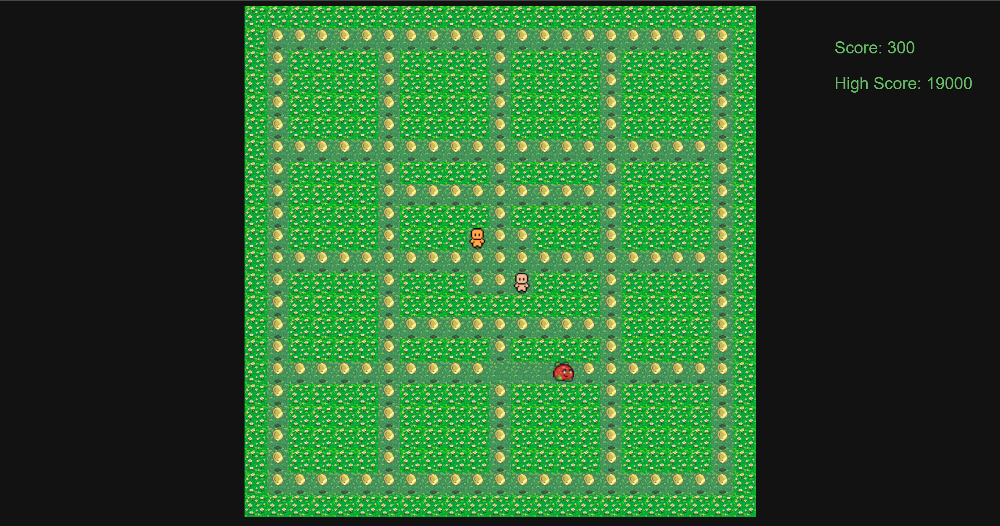

# Scary Berry
Overview: 

This project is a Pac-Man-inspired game where the player navigates a grid while avoiding enemies. The enemies use the A algorithm* for pathfinding, making them increasingly challenging as the game progresses.

The game is designed for entertainment and education, showcasing how algorithms like A* can be applied in interactive applications.

Features:
- Grid-Based Gameplay: Navigate a grid as the player and collect points.
- Pathfinding Enemies: Enemies use the A* algorithm to chase the player dynamically.
- Increasing Difficulty: Enemy speed increases as you collect more points.
- Score Tracking: Keep track of your high scores using local storage.

Play Now
https://integration-nation.github.io/PACMAN-CLONE-SCARY-BERRY/

## Run Locally

Clone the project:

```bash
  git clone https://github.com/Integration-Nation/PACMAN-CL

````
Run it in the browser:
```bash
open index.html

````

Enjoy the game !
## Screenshots




## Algorithms and Data Structures


A* Algorithm
The A* algorithm is implemented to guide enemies toward the player. It calculates the shortest path based on the grid layout while avoiding obstacles.

Grid Representation
The game uses a grid data structure where each cell is represented by a value:

- 0: Wall (impassable).
- 1: Path (walkable).
- 3: Player's position.
- 4: Collectible points.
Development:

The game is written in modern JavaScript and utilizes modular design for better code organization.

Key Files:
- app.js: Main game logic, including player movement, game loop, and event handling.
- aStar.js: Implementation of the A* algorithm for enemy movement.
- grid.js: Manages the grid data structure.


## Authors

- [Adam Warfa](https://github.com/AdamWarfa)
- [Yousra Diab](https://github.com/yousradiab)
- [Nouhayla Oubelaid](https://github.com/Nouhayla-code)


